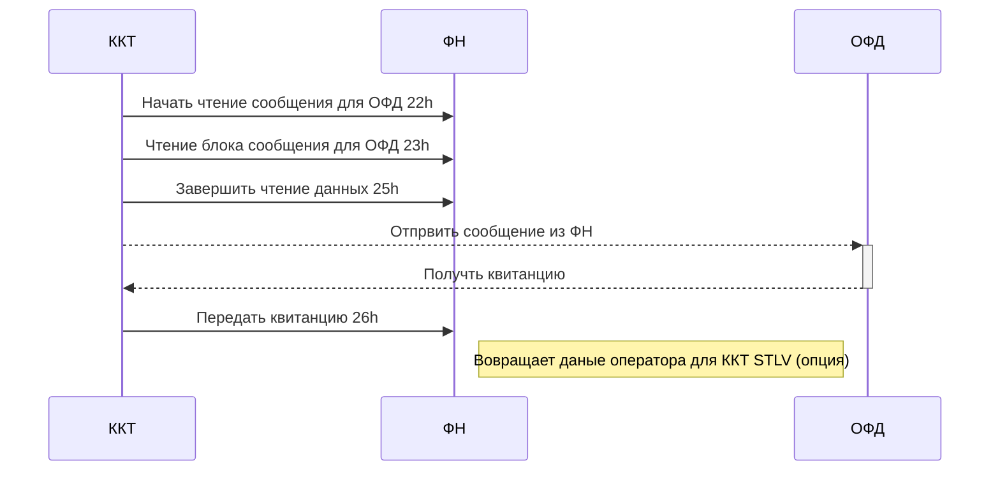
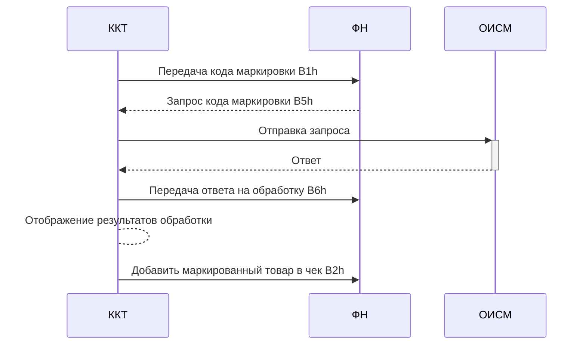
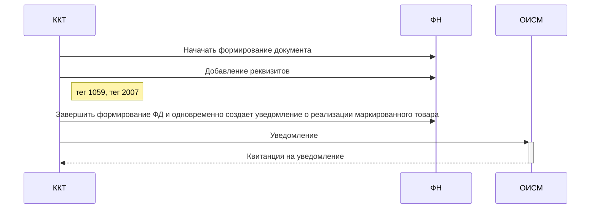

# Алоритмы работы с ФН

Описание некоторых алгоритмов работы ККТ и фискального накопителя

## Обмен с ОФД

## Проверка кода маркировки (КМ)

## Формирование кассового чека для маркированного товара

