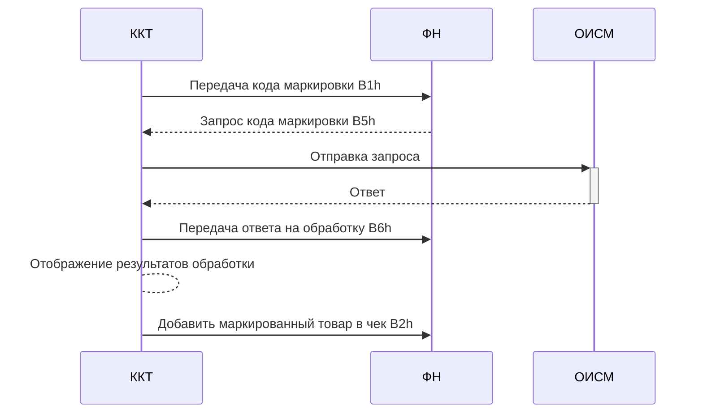
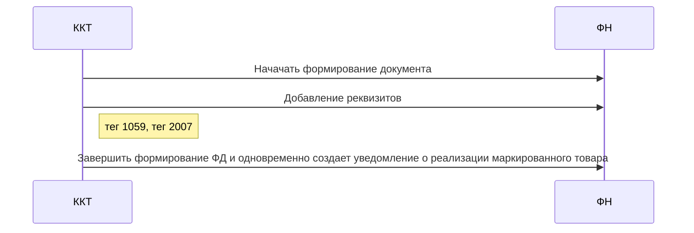

# Алоритмы работы с ФН

Описание некоторых алгоритмов работы ККТ и фискального накопителя

## Проверка кода маркировки (КМ)

```mermaid
sequenceDiagram
    ККТ->>ФН: Передача кода маркировки B1h
    ФН-->>ККТ: Запрос кода маркировки B5h
    ККТ->>+ОИСМ: Отправка запроса
    ОИСМ-->>-ККТ: Ответ
    ККТ->>ФН: Передача ответа на обработку B6h
    ККТ-->ККТ:Отображение результатов обработки
    ККТ->>ФН: Добавить маркированный товар в чек B2h
```

## Формирование кассового чека

```mermaid
sequenceDiagram
    ККТ->>ФН: Начачать формирование документа
    ККТ->>ФН: Добавление реквизитов
    Note right of ККТ: тег 1059, тег 2007
    ККТ->>ФН: Завершить формирование ФД и одновременно создает уведомление о реализации маркированного товара
```
